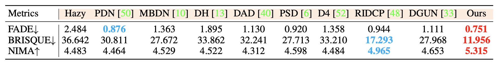
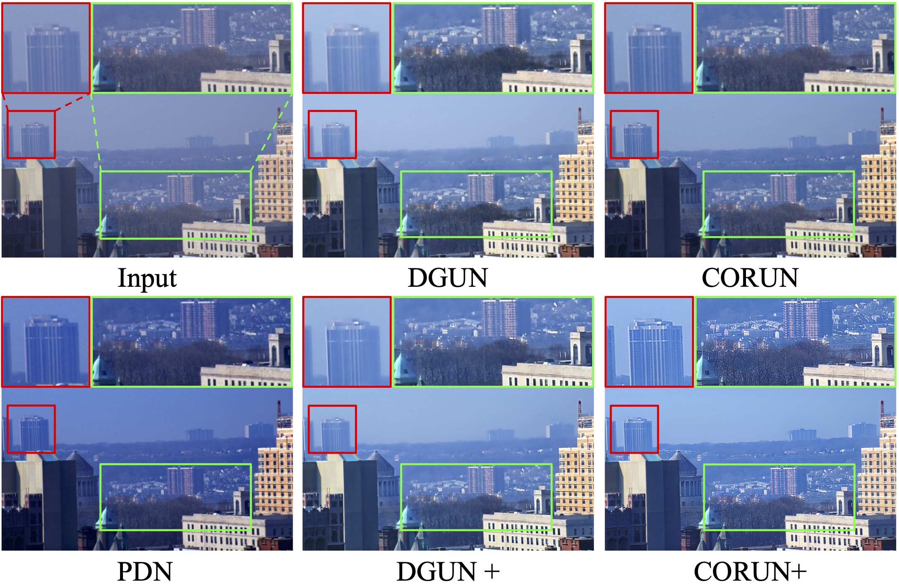

# CORUN 🏃 | Colabator 🏃🏻‍♂️
Official Code for "Real-world Image Dehazing with Coherence-based Label Generator and Cooperative Unfolding Network" <a href='https://arxiv.org/pdf/2406.07966'></a> 

[Chengyu Fang](https://cnyvfang.github.io/), [Chunming He](https://chunminghe.github.io/), Fengyang Xiao, [Yulun Zhang](https://yulunzhang.com), Longxiang Tang, Yuelin Zhang, [Kai Li](https://kailigo.github.io), and Xiu Li

```
The code is currently being cleaned and organized.
There might be issues with the code in the repository at this moment. 
We will finalize all the code before the conference and upload the corresponding scripts and pre-trained weights.
```

**Abstract:** Real-world Image Dehazing (RID) aims to alleviate haze-induced degradation in real-world settings. This task remains challenging due to the complexities in accurately modeling real haze distributions and the scarcity of paired real-world data. To address these challenges, we first introduce a cooperative unfolding network that jointly models atmospheric scattering and image scenes, effectively integrating physical knowledge into deep networks to restore haze-contaminated details. Additionally, we propose the first RID-oriented iterative mean-teacher framework, termed the Coherence-based Label Generator, to generate high-quality pseudo labels for network training. Specifically, we provide an optimal label pool to store the best pseudo-labels during network training, leveraging both global and local coherence to select high-quality candidates and assign weights to prioritize haze-free regions. We verify the effectiveness of our method, with experiments demonstrating that it achieves state-of-the-art performance on RID tasks.  


<details>
<summary>🏃 The architecture of the proposed CORUN with the details at k-th stage (CORUN)</summary>
<center>
    
</center>
</details>

<details>
<summary>🏃🏻‍♂️ The plug-and-play Coherence-based Pseudo Labeling paradigm (Colabator)</summary>
<center>
    
    <br>
</center>
</details>


## 🔥 News
- **2024-09-26:** This paper has been accepted by **NeurIPS 2024 as a Spotlight Paper**. 🎉 Thanks all the participants, reviewers, chairs and committee. We will release the code soon.
- **2024-07-26:** We have organized and refined the code for the Colabator framework into a separate repository to facilitate more efficient application across different networks and tasks. The repository of Colabator Template will be made public together with the code of this repository once the paper is accepted. 😚
- **2024-06-13:** We release the preprint and the citation.
- **2024-06-12:** We release the results and acknowledgements of this work.
- **2024-05-28:** We release this repository, the preprint of full paper will be release soon.


## 🔧 Todo 
- [ ] Complete this repository
- [x] Release the preprint


## 🔗 Contents

- [ ] Datasets
- [ ] Pretrained Weights
- [ ] Options & Train/Test Scrips
- [x] Training Code
- [x] Testing Code
- [x] [Results](https://github.com/cnyvfang/CORUN-Colabator/blob/main/README.md#-results)
- [x] [Citation](https://github.com/cnyvfang/CORUN-Colabator/blob/main/README.md#-citation)
- [x] [Acknowledgements](https://github.com/cnyvfang/CORUN-Colabator/blob/main/README.md#-acknowledgements)


## 🔍 Results

We achieved state-of-the-art performance on *RTTS* and *Fattal's* datasets and corresponding downstream tasks. More results can be found in the paper.

<details>
<summary>Quantitative Comparison (click to expand)</summary>

- Quantitative results on RTTS
  <p align="center">
  
  </p>
- User study scores on RTTS and Fattal’s data
  <p align="center">
  
  </p>
- Object detection results on RTTS
  <p align="center">
  
  </p>  
  </details>

<details> 
<summary>Visual Comparison (click to expand)</summary>

- Results of cutting-edge methods based on deep unfolding networks.
  <p align="center">
  
  </p>
- Visual comparison on RTTS
  <p align="center">
  
  </p>
- Visual comparison on Fattal’s data
  <p align="center">
  
  </p>
- Visual comparison of object detection on RTTS
  <p align="center">
  
  </p>
  
  </details>


## 📎 Citation

If you find the code helpful in your resarch or work, please cite the following paper(s).

```
@misc{fang2024realworld,
      title={Real-world Image Dehazing with Coherence-based Label Generator and Cooperative Unfolding Network}, 
      author={Chengyu Fang and Chunming He and Fengyang Xiao and Yulun Zhang and Longxiang Tang and Yuelin Zhang and Kai Li and Xiu Li},
      year={2024},
      eprint={2406.07966},
      archivePrefix={arXiv},
      primaryClass={cs.CV}
}
```


## 💡 Acknowledgements
The codes are based on [BasicSR](https://github.com/XPixelGroup/BasicSR). Please also follow their licenses. Thanks for their awesome works.
