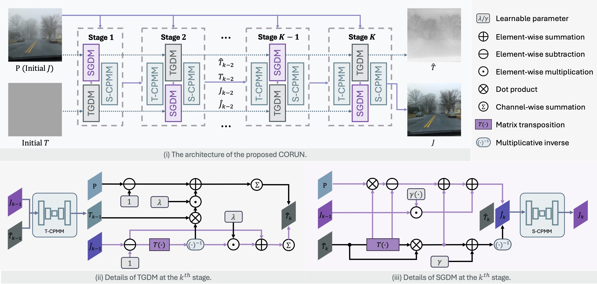
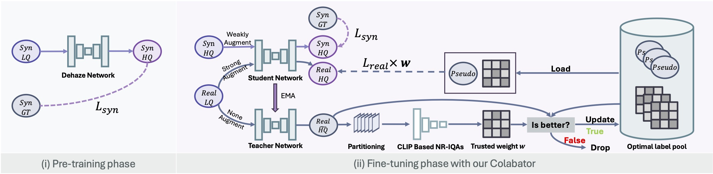
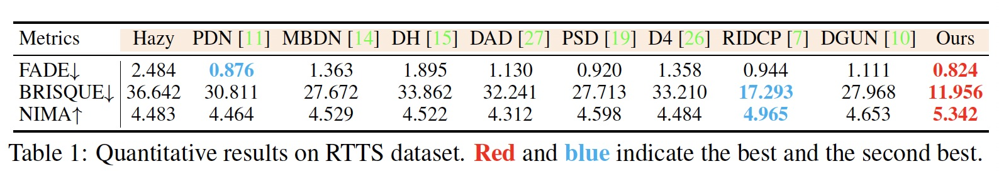
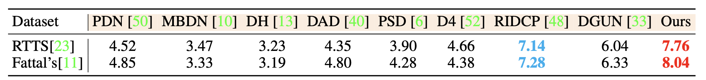
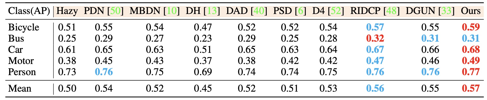
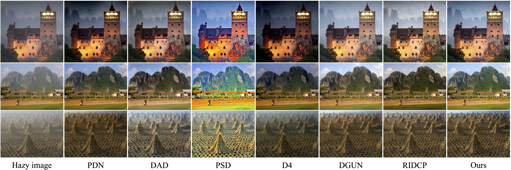
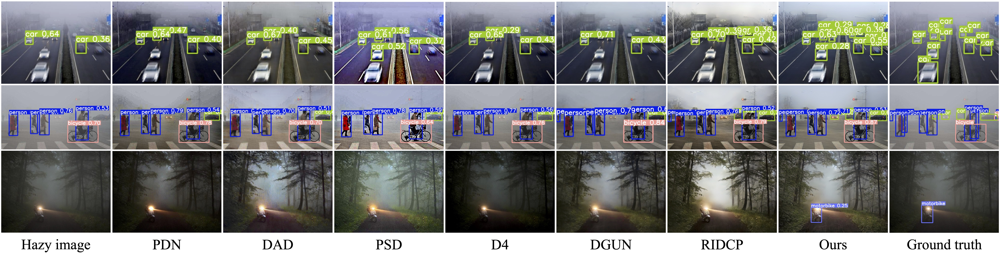

<p align=center> </p>

# <p align=center> `CORUN 🏃 Colabator 🏃🏻‍♂️` </p>

<b><p align=center> <a href='https://arxiv.org/pdf/2406.07966'></a>
  NeurIPS2024 Spotlight ✨</p></b>

This is the official PyTorch codes for the paper. 
>**Real-world Image Dehazing with Coherence-based Label Generator and Cooperative Unfolding Network** <br> [Chengyu Fang](https://cnyvfang.github.io/), [Chunming He](https://chunminghe.github.io/), Fengyang Xiao, [Yulun Zhang](https://yulunzhang.com), Longxiang Tang, Yuelin Zhang, [Kai Li](https://kailigo.github.io), and Xiu Li <br>
> Advances in Neural Information Processing Systems 2024<br>

[//]: # (**Abstract:** Real-world Image Dehazing &#40;RID&#41; aims to alleviate haze-induced degradation in real-world settings. This task remains challenging due to the complexities in accurately modeling real haze distributions and the scarcity of paired real-world data. To address these challenges, we first introduce a cooperative unfolding network that jointly models atmospheric scattering and image scenes, effectively integrating physical knowledge into deep networks to restore haze-contaminated details. Additionally, we propose the first RID-oriented iterative mean-teacher framework, termed the Coherence-based Label Generator, to generate high-quality pseudo labels for network training. Specifically, we provide an optimal label pool to store the best pseudo-labels during network training, leveraging both global and local coherence to select high-quality candidates and assign weights to prioritize haze-free regions. We verify the effectiveness of our method, with experiments demonstrating that it achieves state-of-the-art performance on RID tasks.  )


<details open>
<summary>🏃 The architecture of the proposed CORUN with the details at k-th stage (CORUN)</summary>
<center>
    
</center>
</details>

<details open>
<summary>🏃🏻‍♂️ The plug-and-play Coherence-based Pseudo Labeling paradigm (Colabator)</summary>
<center>
    
    <br>
</center>
</details>


## 🔥 News
```
⚠️ We found that the previous installation script installed an incorrect version 
of PyTorch and Numpy, which led to erroneous experimental results. Users who used
the repository code before 2024-10-23 should reconfigure the environment using the
new script, and ensure that PyTorch version 2.1.2 is installed.
```
- **2024-11-06:** We fix some bugs in the code and support the single GPU training now. 🐞
- **2024-10-26:** Our results and pre-trained weights have been released! ❤️
- **2024-10-23:** We are processing the camera-ready version of this paper, the pretrained weights and test results will be released soon.
- **2024-09-26:** This paper has been accepted by **NeurIPS 2024 as a Spotlight Paper**. 🎉 Thanks all the participants, reviewers, chairs and committee. We will release the code soon.
- **2024-07-26:** We have organized and refined the code for the Colabator framework into a separate repository to facilitate more efficient application across different networks and tasks. The repository of Colabator Template will be made public together with the code of this repository once the paper is accepted. 😚
- **2024-06-13:** We release the preprint and the citation.
- **2024-06-12:** We release the results and acknowledgements of this work.
- **2024-05-28:** We release this repository, the preprint of full paper will be release soon.


## ⚙️ Dependencies and Installation

### Datasets

- **RTTS** dataset can be downloaded from [Dropbox](https://utexas.app.box.com/s/2yekra41udg9rgyzi3ysi513cps621qz).
- **URHI** dataset can be downloaded from [Dropbox](https://utexas.app.box.com/s/7hu094vwkw0cwowv5wijwv9pure2fvup).
- **Duplicate Removed URHI** can be downloaded from [Google Drive](https://drive.google.com/file/d/1B29LsNhBWoRHDk2R_cc5nNqcn7c87sg-/view?usp=sharing)
- **RIDCP500** can be downloaded from [RIDCP's Repo](https://github.com/RQ-Wu/RIDCP_dehazing)

We provide two types of dataset loading functions for model training: one **loads clean images and corresponding depth maps to generate hazy images** using the RIDCP Data Generation Pipeline, and the other **directly loads paired clean and degraded images**. You can choose the appropriate method based on your dataset and task.

**For the haze generation method**, we support reading the RIDCP500 dataset (where depth maps are stored as .npy files) as well as the OTS/ITS datasets (where depth maps are stored as .mat files). If your dataset contains paired clean images and depth maps, you can also use your own dataset. If your dataset does not include depth maps, you can generate corresponding depth maps using methods such as RA-Depth.
**For the paired degraded-clean method**, you can use any paired degraded-clean image pairs for training and testing.

### Initialize Conda Environment and Clone Repo
```bash
git clone https://github.com/cnyvfang/CORUN-Colabator.git
conda create -n corun_colabator python=3.9
conda activate corun_colabator
# If necessary, Replace pytorch-cuda=? with the compatible version of your GPU driver.
conda install pytorch==2.1.2 torchvision==0.16.2 torchaudio==2.1.2 pytorch-cuda=12.1 -c pytorch -c nvidia

```

### Install Modified BasicSR
```bash
cd basicsr_modified
pip install tb-nightly -i https://mirrors.aliyun.com/pypi/simple # Run this line if in Chinese Mainland
pip install -r requirements.txt
python setup.py develop
cd ..
```

### Install Our CORUN-Colabator
```bash
pip install -r requirements.txt
python setup.py develop
python init_modules.py
```
🚩 If you are in China Mainland, run the script before init_modules.py to speed up the download of the pre-trained models:
```bash
export HF_ENDPOINT=https://hf-mirror.com
```

Download the pre-trained da-clip weights and place it in `./pretrained_weights/`. You can download the daclip weights we used from [Google Drive](https://drive.google.com/file/d/1bIlKYouxwizQXbud7SXd5F5oOyoHFH4x/view?usp=sharing). You can also choose other type of clip models and corresponding weights from openclip, if you do this, don't forget to modify your options.


## 🏃 Train
⚠️ **Please replace the dataset path in the options file with your own dataset path.**
### Pretrain CORUN
```bash
# Multi-GPU
sh options/train_corun_with_depth.sh
# Single-GPU
sh options/train_corun_with_depth_single_gpu.sh

```
### Fine-tune CORUN with Colabator
```bash
# Multi-GPU
sh options/train_colabator_with_transmission.sh
# Single-GPU
sh options/train_colabator_with_transmission_single_gpu.sh
```

✨ **To fine-tune your own model using Colabator, you only need to add your network to corun_colabator/archs, define your own configuration file as sample_options and run the script.**

## 🏃‍♂️ Test
Download the pre-trained CORUN weight and place it in `./pretrained_weights/`. You can download the CORUN+ weight from [Google Drive](https://drive.google.com/file/d/18afbgAOLYYr8Ef4JsUtz8WNl9xzQ3cd9/view?usp=sharing)

### Inference
```bash
CUDA_VISIBLE_DEVICES=0 sh options/valid.corun.sh
# OR
CUDA_VISIBLE_DEVICES=0  python3  corun_colabator/simple_test.py \
  --opt options/test_corun.yml \
  --input_dir /path/to/testset/images  \
  --result_dir ./results/CORUN \
  --weights ./pretrained_weights/CORUN.pth \
  --dataset RTTS
```

### Evalutation
Caculate the NIMA and BRISQUE results.
```bash
CUDA_VISIBLE_DEVICES=0 python evaluate.py --input_dir /path/to/results
```

## 🔍 Results

We achieved state-of-the-art performance on *RTTS* and *Fattal's* datasets and corresponding downstream tasks. More results can be found in the paper.
**To quickly use the results of our experiments without manual inference or retraining, you can download all files dehazed/restored by our model from [Google Drive](https://drive.google.com/file/d/1yhaNHc8eV-88Bn7YKa7PehZsUddRBjA1/view?usp=sharing).** 

<details>
<summary>Quantitative Comparison (click to expand)</summary>

- Quantitative results on RTTS
  <p align="center">
  
  </p>
- User study scores on RTTS and Fattal’s data
  <p align="center">
  
  </p>
- Object detection results on RTTS
  <p align="center">
  
  </p>  
  </details>

<details open> 
<summary>Visual Comparison (click to expand)</summary>

- Visual comparison on RTTS
  <p align="center">
  
  </p>
- Visual comparison on Fattal’s data
  <p align="center">
  
  </p>
- Visual comparison of object detection on RTTS
  <p align="center">
  
  </p>
  
  </details>


## 📎 Citation

If you find the code helpful in your resarch or work, please cite the following paper(s).

```
@misc{fang2024realworld,
      title={Real-world Image Dehazing with Coherence-based Label Generator and Cooperative Unfolding Network}, 
      author={Chengyu Fang and Chunming He and Fengyang Xiao and Yulun Zhang and Longxiang Tang and Yuelin Zhang and Kai Li and Xiu Li},
      year={2024},
      eprint={2406.07966},
      archivePrefix={arXiv},
      primaryClass={cs.CV}
}
```


## 💡 Acknowledgements
The codes are based on [BasicSR](https://github.com/XPixelGroup/BasicSR). Please also follow their licenses. Thanks for their awesome works.
